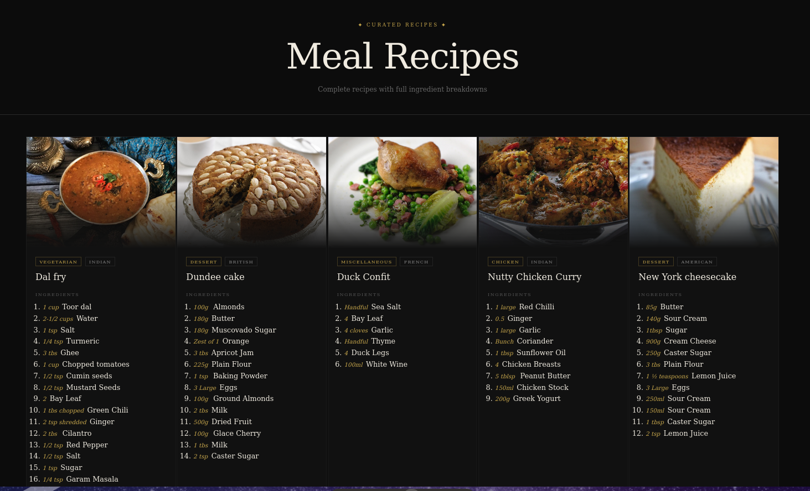

# 🍽️ Meal Recipes

A React-based meal recipe listing app that fetches recipes and their full ingredient breakdowns from an API, displayed in an editorial dark-themed layout — built to practice component architecture, state management, and hooks.

## 🚀 Features

- Editorial dark UI with a responsive recipe grid
- Fetches live meal data from [FreeAPI](https://freeapi.app/)
- Displays full ingredient list with measurements per recipe
- Category and cuisine area tags per meal
- Graceful error handling on fetch failure
- Smooth image overlay and card transitions

## 🛠️ Tech Stack

- **React.js** — component architecture, `useState`, `useEffect`
- **Vanilla CSS-in-JS** — inline styles with a centralized `styles` object
- **FreeAPI** — public meals data API

## 📦 Getting Started

```bash
# Clone the repository
git clone https://github.com/Saimahmed78/Meal-Recipes.git

# Navigate into the project
cd Meal-Recipes

# Install dependencies
npm install

# Start the development server
npm run dev
```

## 🔌 API

Data is fetched from:

```
GET https://api.freeapi.app/api/v1/public/meals
```

No API key required.

## 🧠 Concepts Practiced

- `useEffect` for data fetching with cleanup via `AbortController`
- `useState` for managing loading, error, and data states
- Dynamic ingredient extraction using indexed object keys
- Conditional rendering for error states and optional fields
- CSS-in-JS styling with a centralized `styles` object

## 🖼️ Preview

> Editorial dark UI with a responsive recipe grid, ingredient breakdowns, and category/cuisine tags per card.



## 👤 Author

**Saim Ahmed**  
BS Software Engineering — Riphah International University, Faisalabad

<br/>

[](https://github.com/Saimahmed78)
[](https://www.linkedin.com/in/saim-ahmed-722b802ba/)# Meals-Listing
